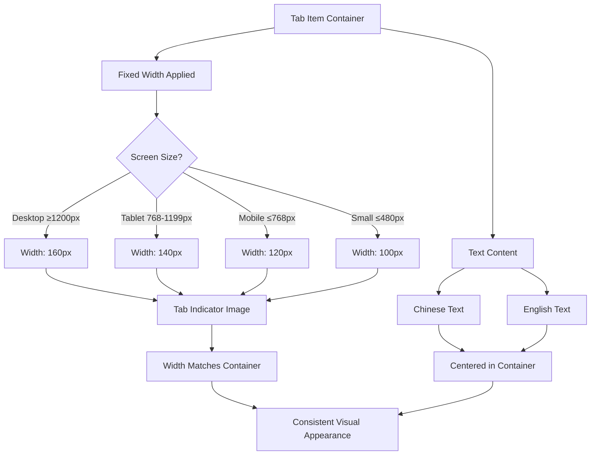

# Design Document

## Overview

This design addresses the visual inconsistency in the Backbag page tab indicators by implementing fixed-width styling for the indicator images. The root cause is that the `.tab-indicator` class currently uses `width: 200px` (and responsive variants), but the container `.tab-item` has flexible padding that expands based on text content. This causes the indicator to appear different sizes across tabs.

The solution involves ensuring that all tab items have consistent dimensions by:
1. Setting fixed widths on the tab items themselves
2. Ensuring text wrapping or truncation for longer content
3. Maintaining proper text centering within the fixed-width containers

## Architecture

### Component Structure

```
Backbag.vue
├── .tabs-area (container)
│   ├── .tab-item (其他 / OTHER ITEMS)
│   │   ├── .tab-indicator (background image)
│   │   ├── .tab-text (Chinese)
│   │   └── .tab-text-en (English)
│   ├── .tab-item (贡品 / TRIBUTE)
│   │   └── ...
│   └── .tab-item (香 / INCENSE)
│       └── ...
```

### Current Issues

1. **Variable Container Width**: `.tab-item` uses `padding: 30px 20px 10px` which allows the container to expand based on content
2. **Text Overflow**: English text "OTHER ITEMS" is longer than "TRIBUTE" or "INCENSE", causing the container to stretch
3. **Indicator Positioning**: The indicator is absolutely positioned but its parent container size varies

## Components and Interfaces

### CSS Class Modifications

#### `.tab-item`
**Current Behavior:**
- Flexible width based on content
- Padding: `30px 20px 10px`

**New Behavior:**
- Fixed width to ensure consistency
- Maintain padding for text positioning
- Use `min-width` and `max-width` to constrain dimensions

#### `.tab-indicator`
**Current Behavior:**
- Fixed width: `200px` (desktop), `120px` (mobile), `100px` (small screens)
- Absolutely positioned

**New Behavior:**
- Keep fixed width values
- Ensure parent container matches these dimensions

#### `.tab-text-en`
**Current Behavior:**
- `white-space: nowrap` prevents wrapping
- No width constraints

**New Behavior:**
- Add `max-width` to prevent overflow
- Consider `text-overflow: ellipsis` for very long text
- Alternatively, reduce font size or letter spacing for "OTHER ITEMS"

## Data Models

No data model changes required. This is purely a CSS styling fix.

## Implementation Strategy

### Option 1: Fixed Tab Item Width (Recommended)

Set a fixed width on `.tab-item` that accommodates the longest text:

```css
.tab-item {
  width: 140px; /* Fixed width for consistency */
  min-width: 140px;
  max-width: 140px;
  /* ... existing styles ... */
}
```

**Pros:**
- Simplest solution
- Guarantees consistency
- No text modification needed

**Cons:**
- May need adjustment for different screen sizes
- Less flexible for future text changes

### Option 2: Constrain English Text

Reduce the visual impact of longer English text:

```css
.tab-text-en {
  max-width: 100px;
  overflow: hidden;
  text-overflow: ellipsis;
  /* ... existing styles ... */
}
```

**Pros:**
- Allows flexible tab widths
- Handles future text changes gracefully

**Cons:**
- May truncate text (though "OTHER ITEMS" would likely fit)
- Requires careful testing

### Option 3: Adjust Font Size for Specific Tabs

Use smaller font size or letter spacing for the "其他" tab:

```css
.tab-item:first-child .tab-text-en {
  font-size: 10px;
  letter-spacing: 0.3px;
}
```

**Pros:**
- Targeted fix for the specific problem
- Minimal impact on other tabs

**Cons:**
- Creates visual inconsistency in font sizes
- Not recommended for design consistency

### Recommended Approach

**Use Option 1 (Fixed Tab Item Width)** as the primary solution, with responsive adjustments:

- Desktop (≥1200px): `width: 160px`
- Tablet (768-1199px): `width: 140px`
- Mobile (≤768px): `width: 120px`
- Small screens (≤480px): `width: 100px`

These widths are chosen to match the indicator image widths at each breakpoint, ensuring perfect alignment.

## Error Handling

No error handling required for CSS changes. Visual regression testing should be performed to ensure:
- All three tabs appear identical in size
- Text remains centered and readable
- No layout shifts occur during tab switching
- Responsive breakpoints maintain consistency

## Testing Strategy

### Visual Testing

1. **Desktop View (1920x1080)**
   - Verify all three tab indicators are identical in size
   - Verify text is centered within indicators
   - Verify no text overflow

2. **Tablet View (768x1024)**
   - Verify consistent indicator sizing
   - Verify text remains readable

3. **Mobile View (375x667)**
   - Verify indicators scale appropriately
   - Verify touch targets remain adequate

4. **Small Screen View (320x568)**
   - Verify indicators don't overlap
   - Verify text doesn't overflow

### Cross-Browser Testing

- Chrome/Edge (Chromium)
- Firefox
- Safari (iOS)

### Interaction Testing

1. Click each tab and verify:
   - Indicator appears correctly
   - Active state styling applies consistently
   - No layout shifts occur

2. Resize browser window and verify:
   - Responsive breakpoints trigger correctly
   - Indicator sizes remain consistent within each breakpoint

## Design Decisions

### Decision 1: Fixed Width vs. Flexible Width

**Choice:** Fixed width for tab items

**Rationale:**
- Ensures perfect visual consistency
- Matches the fixed-width indicator images
- Simpler to implement and maintain
- Aligns with the design intent of having uniform tab navigation

### Decision 2: Responsive Width Values

**Choice:** Match tab item widths to indicator image widths at each breakpoint

**Rationale:**
- Prevents any size discrepancies
- Ensures indicator image fills the tab item perfectly
- Maintains design consistency across all screen sizes

### Decision 3: Text Handling

**Choice:** Keep existing text without truncation or size adjustments

**Rationale:**
- All text currently fits within the proposed fixed widths
- Maintains readability and design consistency
- Avoids creating font size inconsistencies between tabs

## Mermaid Diagram


